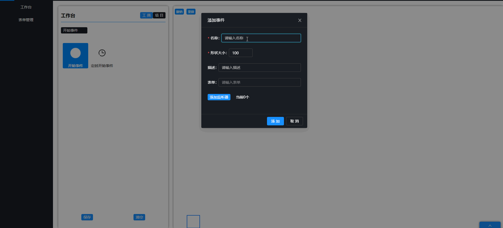

# cl-flow

一个基于`G6`二次开发的流程图引擎，内部自动维护节点与边关系，内置一般常用边形状。只需了解基本API即可进行流程图业务开发，同时也支持G6实例内容定制，可以很方便地加入到`vue`或`react`等前端框架中。 

 

# 效果演示
基于`react`+`Concent`+`antd`+`cl-flow`实现的一个简单流程图设计工具

 

> 推荐一个`react`好用又强大的状态管理库：[Concent](https://concentjs.github.io/concent-doc/guide/first-sight)
